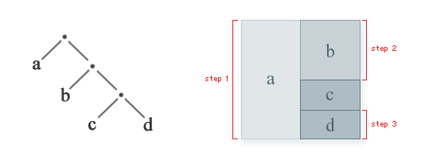
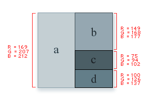

# How selection works
### Abstract

Three methods that can be used for the selection of Components are discussed and compared for their suitability within the GUI library. The article assumes some understanding of the Component hierarchy and some OpenGL knowledge.

## Introduction

User interfaces without mouse support are almost nonexistant these days, and any good user interface toolkit should provide support for selecting objects with the mouse. With this support comes the problem of identifying which objects are under the mouse position and which ones should be selected. This article discusses three solutions to this problem, which—not incidentally—are the three solutions I tried to apply to my GUI toolkit. This does not mean there are no other good solutions, but the third method worked well enough for me. If none of these methods can be applied to your situation, you could use a solution I have yet to try; [shooting a ray from the mouse position into your scene](http://www.bookofhook.com/Article/GameDevelopment/mousepick.pdf) .

## Bounding box checking

The first method is bounding box checking. We check the bounding box of all components and see if the mouse position is inside that box. By traversing the Component hierarchy tree we can find the component we're looking for easily and efficiently. The children of a Component can be discarded by testing the parent Component (these Components are called Containers) first. If the Container does not contain the given mouse coordinates, then nor do its children.

In the example the component called C can be found in only three steps. The root container is first checked. If the mouse location is inside its bounds its children are examined. If component A had children, they would not have to be tested because they would all be within the bounds of component A. Component B is discarded in the next step. In the final step only C and D need to be checked against the mouse locations. Finally, C is found. While this method has only a small advantage over simply checking all components in our example, it is not hard to imagine the speed gain if component A would have contained a few hundred other components.

Unfortunately, the downside of this method is that it does not work very well with 3D interfaces and I was thus forced to look for other alternatives and found a—what seemed to be perfect—alternative: [OpenGL Picking](http://www.rush3d.com/reference/opengl-redbook-1.1/chapter12.html) .

## OpenGL Selection buffer

This method uses builtin OpenGL functionality, called the selection buffer. The selection buffer works by rendering primitives in a seperate pass to a special buffer and returning information about those primitives afterwards. After the selection pass, the scene should be rendered again in the normal rendering buffers.

To make this work, the library has to assign a unique identifier to each component. After all components are processed—OpenGL does not render anything in selection mode—it returns the identifiers and depth values of the components at the mouse location as a table. After sorting this table by depth and hierarchy order, and looking up the correct component, picking worked as it should.

#### Note

The method used to extract information from the selection buffer by some widely available tutorials wrongly assume that the selection buffer returns information in a fixed format (4 entries for each hit), but this is not the case. The number of entries for a hit depend on how many hits occurred, which sometimes equals 4, but not always. Correct information can be found at the [OpenGL Developers page](http://www.opengl.org/developers/faqs/technical/selection.htm) and [Lighthouse3d](http://www.lighthouse3d.com/opengl/picking/index.php3?openglway) .

Even after transformations, such as scaling and rotation, are supported by this method. This means it works in 3D. I however ran into a strange problem while writing the `ScrollPane` class, which uses OpenGL scissor tests for masking areas that should be hidden. The selection of components still worked outside these masked areas. Unfortunately this is default behaviour of the selection and feedback modes, as explained by the following quote from the OpenGL Manual:
>
Note: In both feedback and selection modes, information on objects is returned prior to any fragment tests. Thus, objects that would not be drawn due to failure of the scissor, alpha, depth, or stencil tests may still have their data processed and returned in both feedback and selection modes.

Scissor testing does not affect the picking area, so objects outside the scissor area would—while failing the fragment tests and thus being invisible—still be pickable. Bummer.

While searching for a solution I found a page on the OpenGL developers page which contains a short description of an alternative picking method [color coding](http://www.rush3d.com/reference/opengl-redbook-1.1/chapter13.html) (See “Object Selection Using the Back Buffer”).

## Color coding

Lets start with the description from the OpenGL developers page:
>
OpenGL provides the GL_SELECTION render mode for this [picking] purpose. However, you can use other methods. You might render each primitive in a unique color, then use glReadPixels() to read the single pixel under the current mouse location. Examining the color determines the primitive that the user selected.

This method also requires two render passes, but without swapping the buffers or other—usually expensive—state changes. The first pass involves rendering unique colored primitives to the back buffer, then reading back the pixel color under the mouse position and comparing that with the unique colors of each component stored in a lookup table.

If we go back to the example used earlier, the picture on the right shows what the selection pass would look like, with each component having a unique color. The second pass will paint the normal scene on top of the selection pass, which is what the end user sees. Rendering the scene twice probably sounds expensive, but the first pass can be optimized by only rendering a simplified version of the real scene. For example, the GUI library only renders flat shaded quads to the screen in the selection pass, while the normal pass renders more sophisticated versions, with borders, gradients and text. Another optimization would be to only render the scene near the mouse location.

One problem with this method is the uniqueness of a color. If there are more unique objects in a scene then there are unique colors the system could select the wrong objects. This could be solved by introducing multiple selection passes. Another problem is that the unique color should be the same when it was rendered to the screen and when it was read back from the screen. Settings that could possibly change colors, such as dithering and lighting should be turned off. Another caveat is when the selection buffer is rendered to a texture, because texture colors are slighlyt different from primitive colors when rendered. To solve this problem, one could render the color to the screen and to a texture and read back the values at startup, and use those values in the lookup table.

As for the advantages of this method, it is fairly fast compared to OpenGL picking (albeit slower than the bounding box method). Another advantage is that the selection primitives are no longer bound to rectangular shapes, even textures and alpha channels can be used as selection data. Imagine round buttons with holes in them. It also works flawlessly with all transformations, fragment tests and even in 3D.

## Conclusion

In the end, the third method turned out to be the most suitable for the GUI library. The other two methods can be useful for other applications. If your hierarchy is simple, 2D and does not have many special cases, the first method is highly recommended. The second method could be useful for when 3D picking is required, unless you need fragment tests. If none of this works for your application, the method mentioned in the introduction might be something for you.
