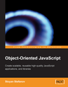

## Review of "Object Oriented JavaScript" by Stoyan Stefanov

<figure>

</figure>

A few weeks ago I was asked by [Packt Publishing](http://www.packtpub.com/) to review one of their titles [Object Oriented JavaScript: Create scalable, reusable high-quality JavaScript applications and libraries](http://www.packtpub.com/object-oriented-javascript-applications-libraries/book). As an avid reader and obsessed with all things JavaScript I couldn't say no. What follows is based on the notes I took while reading. The book starts with a good introduction to the various aspects of JavaScript, from data types and control structures in Chapter 2 to functions and objects in Chapter 3 and 4. I'm not going to say much about these introduction chapters; the writing is clear and contains plenty of examples you can follow along. Although these chapters provide a good introduction to basic JavaScript, you could find the same information in most other JavaScript books ([JavaScript the Definitive Guide](http://oreilly.com/catalog/9780596000486/) comes to mind.)

## Prototypes and inheritance

The interesting stuff however starts in Chapter 5 with an in-depth discussion of JavaScript's prototype based nature. This and the next chapter provide one of the clearest introductions to prototype based programming I have seen so far. If you're already familiar with basic JavaScript but unsure about your knowledge of prototypes, this would be a good place to start.

Chapter 5 also contains a section about augmenting the built-in objects such as `Object`, `Array`, and `Function`. I was pleased to see this make an appearance, as it is in my opinion a valid and beautiful technique for extending a language with new concepts and constructs. It is unfortunate that many leading JavaScript authors consider it an outlawed practice. The most often cited reasons for banning it are: breaking old scripts that rely on unfiltered for in loops, performance regressions, and incompatibility with future extension to the core language.

Chapter 6 introduces various forms of inheritance, such as classical, prototypical, and parasitic and the differences between them. It is very nice to see a book on JavaScript take a modern approach to writing JavaScript. Many JavaScript libraries and books try to shoehorn the language into a more traditional object oriented programming language such as Java. This book shows that there are better and simpler alternatives to classical inheritance available in prototype based languages (and if you really want to use classical inheritance it will show you how to do that as well.)

## Interlude: The Browser Environment

I'm not entirely sure about Chapter 7 "The Browser Environment". It doesn't quite seem to fit in this mostly language oriented book. Although the book does an excellent job at giving an overview of both the DOM and BOM, there are other books which give more in-depth details of the browser environment. Regardless, it serves as a good overview of the topic and the reader can explore the introduced topics in more depth through other books and websites. I personally would have preferred a "pure" JavaScript book, but I don't blame the author; writing a JavaScript book without even mentioning the browser is a risky choice.

## Coding and design patterns

Chapter 8 "Coding and Design Patterns" is in my opinion the most interesting chapter. It introduces various coding and design patterns such as initialization time branching and configuration objects. Initialization time branching is a very powerful tool. I use it extensively in my [JavaScript functional pattern matching library](../projects/funcy/) to parse and preprocess patterns at initialization time instead of run-time, thereby saving considerable processing time when pattern matched functions are called.

It is good to see the configuration objects pattern (sometimes referred to as option objects) described as it is used extensively in almost all JavaScript libraries. One minor caveat; remember to check if the configuration object is defined. In my code I usually have one or two required parameters and an optional configuration object. In this case it is important to check if the configuration object is defined (the sample code in the book does not perform this check.)

The chapter also introduces JSON as a coding pattern and briefly compares it to XML as a lightweight and easy to parse alternative. Unfortunately, my REST backend web services typically produce XML documents because most of my data sources are either XML or HTML. Instead of parsing XML on the client side I apply an [XSLT transformation that transforms the XML to JSON](http://www.bramstein.com/projects/xsltjson/).

The chapter continues with a selection of patterns from the famous [Gang of Four book](http://www.amazon.com/Design-Patterns-Object-Oriented-Addison-Wesley-Professional/dp/0201633612) implemented in JavaScript. I particularly like the observer pattern, which is a good example of the power of mixins. The book implements this with a special `make` method as part of the observer namespace. I usually create mixins without a special `make` method by using a variant of constructor functions.

    var observer = function(o) {
      o.addSubscriber = function (callback) {
      …
      };

      …
      return o;
    };

    // mix-in to existing objects
    blogger = observer(blogger);

    // or mix-in to new objects
    var ny_times = observer({});

This method is described in more detail in Douglas Crockford's [JavaScript: the Good Parts](http://oreilly.com/catalog/9780596517748/), which I also highly recommend (although it is much tougher to get through than this book.)

## Conclusion

The description and implementation of the observer pattern also concludes the book. I had mixed feelings at this point, excited about finally having a book that discusses JavaScript design patterns and sadness about coming to the end of the book. I would have loved to see more patterns and perhaps even a style guide. I also wouldn't have mind an introduction to the Mozilla JavaScript extensions introduced in Firefox. Although these are only available on Mozilla and some other open source browsers, their use will most likely increase in months to come, and hopefully see implementations in other browsers.

Don't take my wishful thinking as something negative about the book though. I found it to be a very good book, and highly recommend it if you are looking for a good introduction to JavaScript or to upgrade your skills to "modern JavaScript".
